## Title: Analyzing Branch Predictors

|        | Detail |
| ------ | ------ |
| Name   | -- Shaheen Eshghi & Vinh    |
| SFU ID | -- 301305148 & 301449797    |
| Email  | -- seshghie@sfu.ca & qvd@sfu.ca   |

- [Title: Analyzing Branch Predictors](#title-analyzing-branch-predictors)
## [1. Static approaches Q1 and Q2](#1-static-approaches-q1-and-q2)
### [Q1. Which of these two policies is more accurate](#q1-which-of-these-two-policies-is-more-accurate)

  - "600.perlbench_s-210B": Never taken performed better (~45% misprediction) compared to always taken (~63% misprediction).
  - "602.gcc_s-734B": Never taken performed better (~43% misprediction) compared to always taken (~65% misprediction).
  - "625.x264_s-18B" : Always taken performed much better (~32% misprediction) compared to never taken (~78% misprediction).
  - "641.leela_s-800B": Both never taken and always taken performed similarly (~55% and ~54% misprediction respectively). 
  - "648.exchange2_s-1699B": Always taken performed better (~40% misprediction) compared to never taken (~68% misprediction).

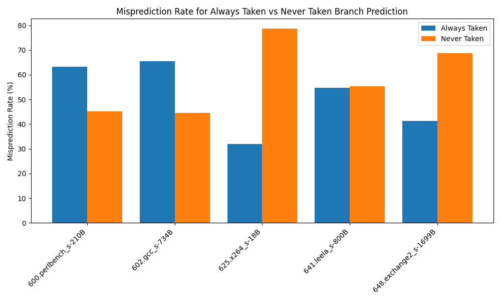
### [Q2. Based on common programming idioms, what might explain the above result?](#q2-based-on-common-programming-idioms-what-might-explain-the-above-result)

  - Some benchmarks may include loops, recursive calls, or error handling code that exhibits highly predictable taken or not-taken branches. For example, system-level benchmarks or applications with frequent conditional checks may have many branches that result in the same outcome repeatedly. In these cases, branches are predictable and taken frequently which benefits the "Always Taken" policy (such as in "625.x264_s-18B" & "648.exchange2_s-1699B"). Conversely, benchmarks where branches are more conditional and less likely to be taken, would benefit the "Never Taken" strategy (such as in "600.perlbench_s-210B" & "602.gcc_s-734B"). Also, some benchmarks might have more dynamic control flow wherein branch direction changes frequently based on input data or internal state, causing both static branch prediction policies to struggle (such as in "641.leela_s-800B"). The alternating performance that we see in the plot between benchmarks suggests varying degrees of branch predictability.

## [2. Bimodal predictor](#2-bimodal-predictor)
  ### [Q3. Bimodal table size $2^8, 2^{10}, 2^{12}, 2^{16}, 2^{20}$ vs accuracy. On the y-axis, plot "accuracy" (larger is better)](#q3-bimodal-table-size-28-210-212-216-220-vs-accuracy-on-the-y-axis-plot-accuracy-larger-is-better)
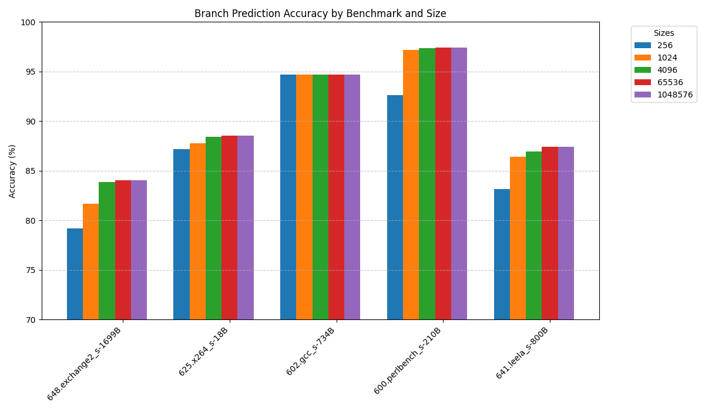
  ### [Q4: Pareto optimality: Given a large enough predictor, what is the best accuracy obtainable by the bimodal predictor?](#q4-pareto-optimality-given-a-large-enough-predictor-what-is-the-best-accuracy-obtainable-by-the-bimodal-predictor)
  - The best accuracy obtainable by the bimodal predictor on 648.exchange2_s-1699B is approximately 84% 
  - The best accuracy obtainable by the bimodal predictor on 625.x264_s-18B is approximately 88% 
  - The best accuracy obtainable by the bimodal predictor on 602.gcc_s-734B is approximately 95% 
  - The best accuracy obtainable by the bimodal predictor on 600.perlbench_s-210B is approximately 97% 
  - The best accuracy obtainable by the bimodal predictor on 6641.leela_s-800Bs approximately 86.5% 
  ### [Q5. How large must the predictor be to improve accuracy by 2x compared to the better of`always taken` and `always not taken`? Give the predictor size both in terms of number of counters as well as bytes.](#q5-how-large-must-the-predictor-be-to-improve-accuracy-by-2x-compared-to-the-better-ofalways-taken-and-always-not-taken-give-the-predictor-size-both-in-terms-of-number-of-counters-as-well-as-bytes)
  - "600.perlbench_s-210B": Never taken performs better than always taken at 45% misprediction. Cutting this misprediction in half we get 22.5%, which translates to a target accuracy of at least 77.5%. From our results, we see that bimodal 256 bytes (2^8) produces the closest result that meets this requirement at 92.5% for 600.perlbench_s-210B.
  - "602.gcc_s-734B": Never taken performs better than always taken at 43% misprediction. Cutting this misprediction in half we get 21.5%, which translates to a target accuracy of at least 78.5%. From our results, we see that bimodal 256 bytes (2^8) produces the closest result that meets this requirement at 95% for 602.gcc_s-734B.
  - "625.x264_s-18B" : Always taken performs better than never taken at 32% misprediction. Cutting this misprediction in half we get 16%, which translates to a target accuracy of at least 84%. From our results, we see that bimodal 256 bytes (2^8) produces the closest result that meets this requirement at 87% for 625.x264_s-18B.
  - "641.leela_s-800B": Always taken performs slightly better than never taken at 54% misprediction. Cutting this misprediction in half we get 27%, which translates to a target accuracy of at least 73%. From our results, we see that bimodal 256 bytes (2^8) produces the closest result that meets this requirement at 83% for 641.leela_s-800B.
  - "648.exchange2_s-1699B": Always taken performs better than never taken at 40% misprediction. Cutting this misprediction in half we get 20%, which translates to a target accuracy of at least 80%. From our results, we see that bimodal 1024 bytes (2^10) produces the closest result that meets this requirement at 81% for 648.exchange2_s-1699B.

  ### [Q6. What is the smallest predictor table size which is within 3%,5%, 10% of the $2^24$ size.](#q6-what-is-the-smallest-predictor-table-size-which-is-within-35-10-of-the-224-size)
  - "600.perlbench_s-210B": Accuracy with 16777216 bytes (2^24) is ~97.5%. The smallest predictor table size which is within 3% is 1024 or 2^10 bytes (~96.5%), and within both 5% and 10% of this is 256 or 2^8 bytes (~92.5%).
  - "602.gcc_s-734B": Accuracy with 16777216 bytes (2^24) is ~94.5%. The smallest predictor table size which is within 3%, 5%, and 10% altogether is 256 or 2^8 bytes (~95%).
  - "625.x264_s-18B" : Accuracy with 16777216 bytes (2^24) is ~88.5%. The smallest predictor table size which is within 3%, 5%, and 10% altogether is 256 or 2^8 bytes (~87%).
  - "641.leela_s-800B": Accuracy with 16777216 bytes (2^24) is ~87.5%. The smallest predictor table size which is within 3% is 1024 or 2^10 bytes (~86%), and within both 5%, and 10% is 256 or 2^8 bytes (~83%).
  - "648.exchange2_s-1699B": Accuracy with 16777216 bytes (2^24) is ~84%. The smallest predictor table size which is within 3% is 1024 or 2^10 bytes (~81.5%), and within both 5%, and 10% is 256 or 2^8 bytes (~79.5%).
## [Global predictor](#global-predictor)
  ### [Q7. Global table size $2^{12}, 2^{16}, 2^{20}$ vs accuracy. Keep the number of PC bits fixed to 10 and vary the GH bits to increase the table size. Plot accuracy](#q7-global-table-size-212-216-220-vs-accuracy-keep-the-number-of-pc-bits-fixed-to-10-and-vary-the-gh-bits-to-increase-the-table-size-plot-accuracy)
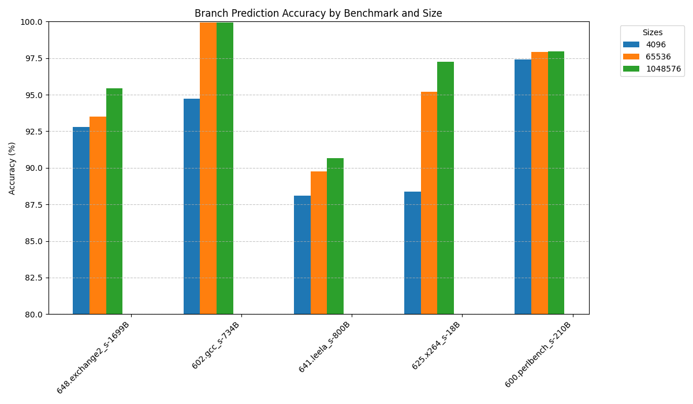
  ### [Q8. Global table size $2^{12}$, $2^{16}$, $2^{20}$ vs accuracy. Keep the number of GHbits fixed to 10 and vary the PC bits to increase the table size. Plot accuracy. Which size performed best ?](#q8-global-table-size-212-216-220-vs-accuracy-keep-the-number-of-ghbits-fixed-to-10-and-vary-the-pc-bits-to-increase-the-table-size-plot-accuracy-which-size-performed-best-)
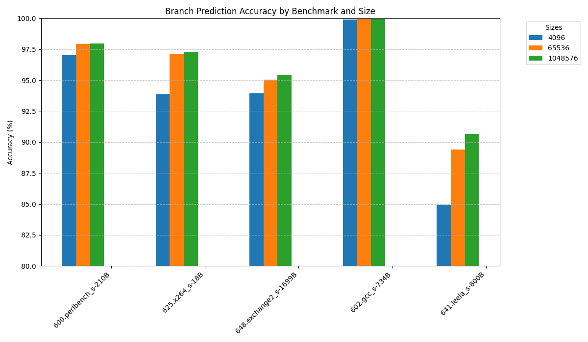
  ### [Q9. For predictor $2^{24}$ what is the accuracy obtained when GH = 10 bits?](#q9-for-predictor-224-what-is-the-accuracy-obtained-when-gh--10-bits)
  - "600.perlbench_s-210B": When fixed GH to 10 bits the accuracy for this benchmark is 97.9469%
  - "602.gcc_s-734B": When fixed GH to 10 bits the accuracy for this benchmark is 99.9223%
  - "625.x264_s-18B" : When fixed GH to 10 bits the accuracy for this benchmark is 97.2693%
  - "641.leela_s-800B": When fixed GH to 10 bits the accuracy for this benchmark is 90.6794%
  - "648.exchange2_s-1699B": When fixed GH to 10 bits the accuracy for this benchmark is 95.4347%
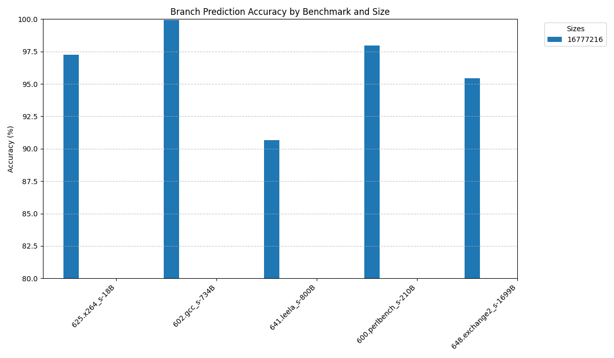

We can observe that the accuracy for the Global branch predictor is always above 90% accuracy proving that it is a pretty good branch predictor for these particular benchmark.

  ### [Q10. For the same table size ($2^{12}$, $2^{16}$, $2^{20}$, $2^{24}$) which branch predictor performed better; bimodal or global?](#q10-for-the-same-table-size-212-216-220-224-which-branch-predictor-performed-better-bimodal-or-global)
  - "600.perlbench_s-210B": We can observe that these branch predictor have accuracy almost idential to one another. We can see that bimodal outperform when we fixed GH bits. In this case, since the table size is 4096 bytes (2^12) and since GH bits is fixed to 10 bits, which means CPU bits is only 2 which might cause a lot of aliasing making it perform sligtly worse than bimodal. However, as we increase the table size, the global always sligtly performce better due to us taking account of the global branch instead of just using the 2 bit counter like bimodal
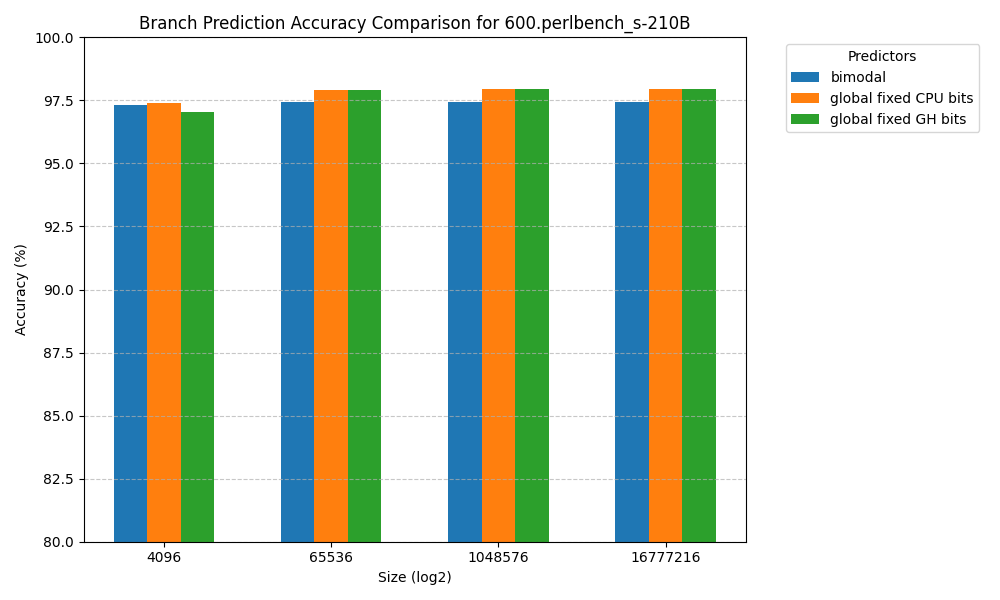
  - "602.gcc_s-734B": For 4096 table size, the global predictor with fixed GH bits performs the best at ~100% accuracy, while the global predictor with fixed CPU bits matches the bimodal predictor with an accuracy of just under 95% accuracy. For 65536, 1048576, and 16777216 table sizes, the global predictos perform best, both at ~100% accuracy.
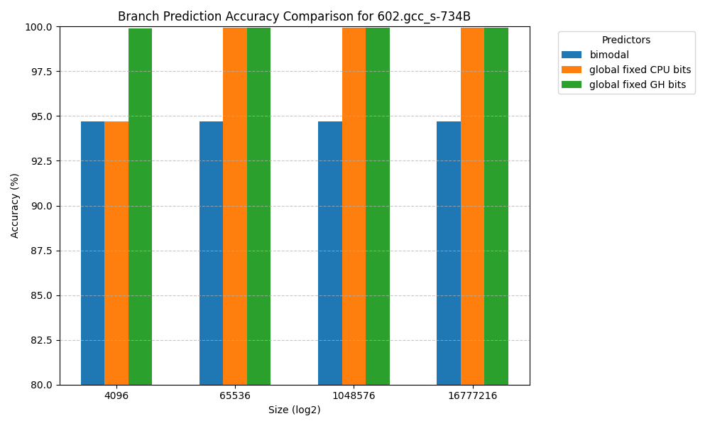
  - "625.x264_s-18B" : For 4096 table size, the global predictor with fixed GH bits performs the best at just under 94% accuracy, while the bimodal predictor very slightly edges out the global predictor with fixed CPU bits at ~88.5% and ~88% accuracy respectively. For 65536 table size, the global predictor with fixed GH bits performs best at ~97% accuracy, while the global predictor with fixed CPU bits is the second best at just over 95% accuracy. For 1048576 table size, the global predictors perform best, both at just under 97.5% accuracy. For 16777216 table size, the global predictor with fixed CPU bits perform best at ~98% accuracy while the blobal predictor with fixed GH bits is the second best at just under 97.5% accuracy.
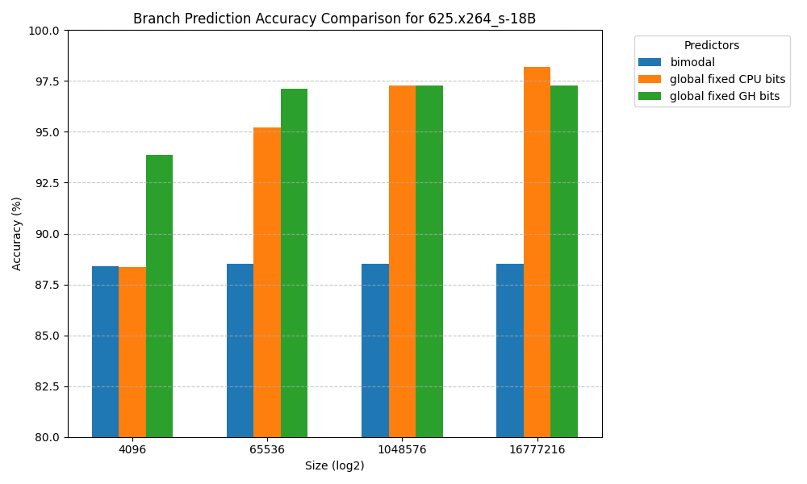
  - "641.leela_s-800B": For 4096 table size, the global predictor with fixed CPU bits performs the best at ~88% accuracy, while the bimodal predictor is the second best at ~87% accuracy, and the global predictor with fixed GH bits is the worst at ~85% accuracy. For 65536 table size, the global predictor with fixed CPU bits performs best at just under ~90% accuracy, while the global predictor with fixed GH bits is the second best at ~89% accuracy. For 1048576 table size, the global predictors perform best, both at ~91% accuracy. For 16777216 table size, the result is almost identical to that of 1048576 table size, but the global predictor with fixed CPU bits performs very slightly better than fixed GH bits at ~91% accuracy.
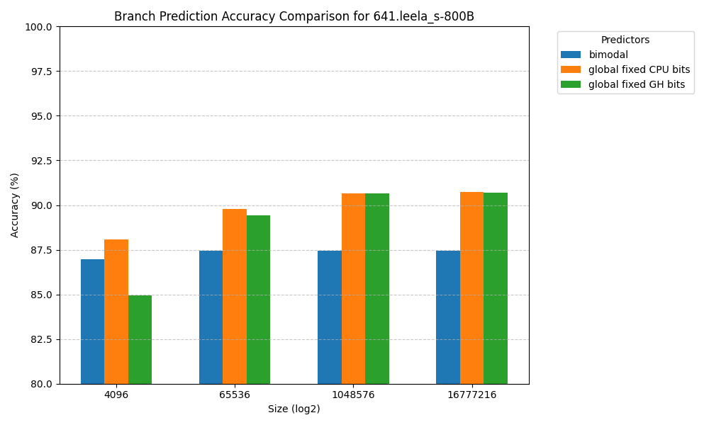
  - "648.exchange2_s-1699B": For 4096 table size, the global predictor with fixed GH bits performs best at ~93.5% accuracy, while the global predictor with fixed CPU bits performs second best at just over 92.5% accuracy. For 65536 table size, the global predictor with fixed GH bits performs best at ~95% accuracy, while the global predictor with fixed CPU bits performs second best at ~93.5% accuracy. For 1048576 table size, the global predictors perform best, both coming in at just over 95% accuracy. For 16777216 table size, the global predictor with fixed CPU bits performs best at ~96% accuracy, while the global predictor with fixed GH bits performs second best at just over 95% accuracy.
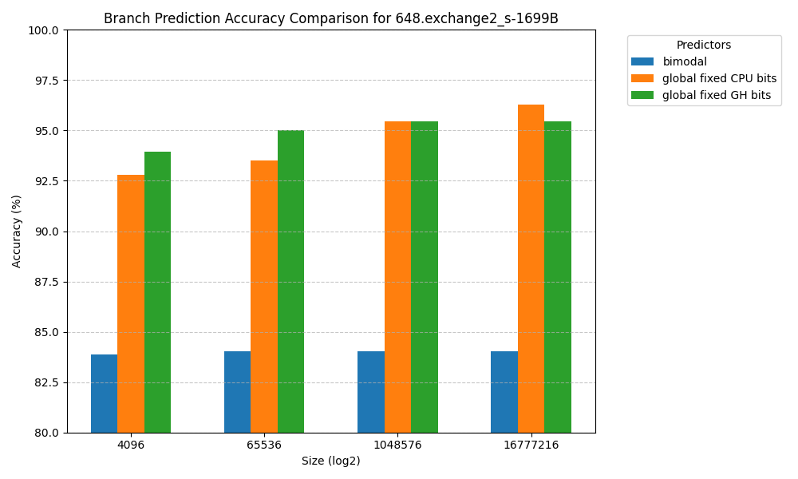
  ### [Q11. Explain why global maybe sometimes more accurate then bimodal. Explain why bimodal may sometimes be more accurate than global?](#q11-explain-why-global-maybe-sometimes-more-accurate-then-bimodal-explain-why-bimodal-may-sometimes-be-more-accurate-than-global)
  - Global predictors (either with fixed CPU or fixed GH bits) generally perform better when handling complex control flow, inter-branch dependencies, and workloads where global context matters such as in "602.gcc_s-734B", "625.x264_s-18B", and "648.exchange2_s-1699B" benchmarks where the largest discrepency in accuracy can be seen between bimodal and global predictors. However, bimodal predictors sometimes offer better accuracy in cases where branch behavior is locally predictable and doesn't depend on the history of other branches, as targetted in some parts of the "600.perlbench_s-210B" or "641.leela_s-800B". While the global predictors do tend to perform better overall for these benchmarks, the discrepency in accuracy between bimodal and global is small compared to the other 3 benchmarks, indicating that the bimodal does provide reasonable benefits at certain points of running the "600.perlbench_s-210B" and "641.leela_s-800B" benchmarks. The differences in branch behavior across these benchmarks explains why we tend to see global predictors perform with higher accuracy overall but not providing a significant benefit over bimodal predictors in specific cases.
## [Local predictor](#local-predictor)
  ### [Q12. Vary table 2 size ($2^{12}$, $2^{16}$, $2^{20}$, $2^{24}$) and keep the number of PC bits fixed to 10 and vary the LH bits to increase the table size. Plot the accuracy for different configurations.](#q12-vary-table-2-size-212-216-220-224-and-keep-the-number-of-pc-bits-fixed-to-10-and-vary-the-lh-bits-to-increase-the-table-size-plot-the-accuracy-for-different-configurations)
  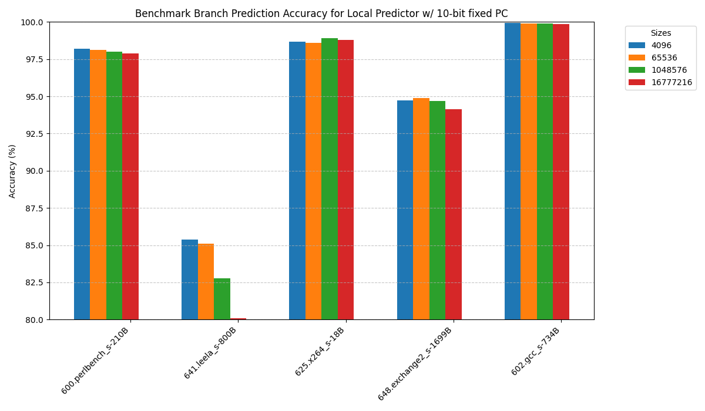
  ### [Q13. Fix table 2 size to $2^{16}$ i.e., number of LH bits = 16. Vary table 1 size from $2^{6}$ to $2^{12}$ in powers of 2. Plot accuracy for different configurations.](#q13-fix-table-2-size-to-216-ie-number-of-lh-bits--16-vary-table-1-size-from-26-to-212-in-powers-of-2-plot-accuracy-for-different-configurations)
  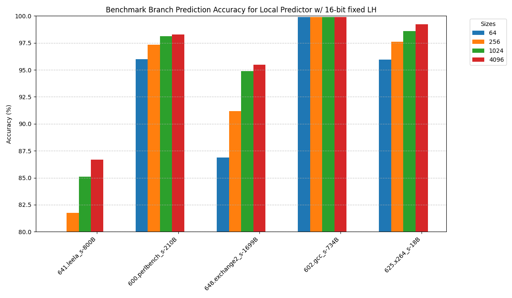
## [Tournament predictor](#tournament-predictor)
  ### [Q14 (Optional). How does the tournament predictor's accuracy compare to bimodal, local, and global? Is the tournament predictor successful in meeting its goal? Try the following configurations (bimodal=$2^{12}$, local=$2^{12}$, global = $2^{12}$, tournament = $3 \\times 2^{12}$). For local and global predictors, use PC and LH bits used in previous questions.](#q14-optional-how-does-the-tournament-predictors-accuracy-compare-to-bimodal-local-and-global-is-the-tournament-predictor-successful-in-meeting-its-goal-try-the-following-configurations-bimodal212-local212-global--212-tournament--3-times-212-for-local-and-global-predictors-use-pc-and-lh-bits-used-in-previous-questions)
- We can observe in the figure below that the tournament performs better compared to using only local or global predictors for each benchmark. This is expected behavior since the tournament predictor selects the best-performing model (global or local) and applies its prediction based on that.
  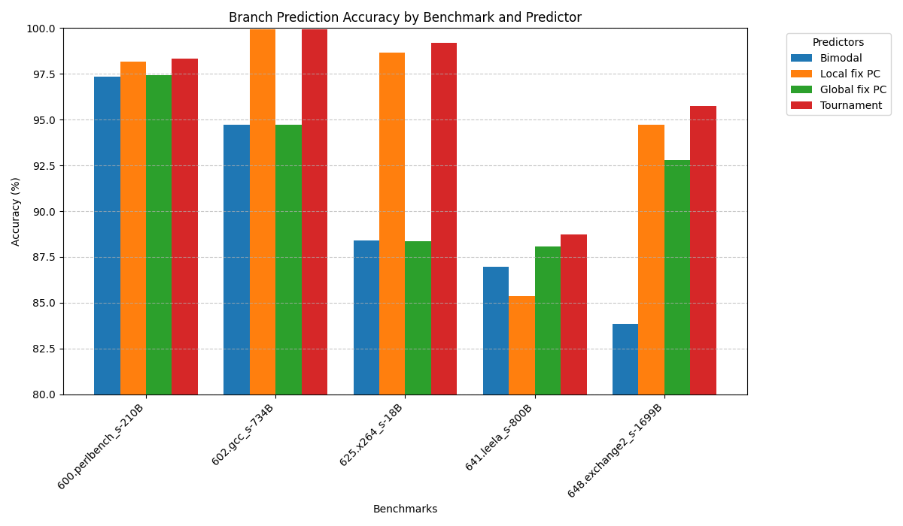
  ### [Q15 (Optional). Does the tournament predictor improve the overall peak (best-case) accuracy? If so, why? If not, what are the benefits of the tournament predictor?](#q15-optional-does-the-tournament-predictor-improve-the-overall-peak-best-case-accuracy-if-so-why-if-not-what-are-the-benefits-of-the-tournament-predictor)
- The tournament predictor does improve the overall peak (best-case) accuracy. As shown in the figure for Q14, we can observe the following:
  - 600.perlbench_s-210B: The accuracy of the tournament predictor is 98.32%, outperforming the bimodal and global predictors, and slightly exceeding the local predictor.
  - 602.gcc_s-734B: The tournament predictor achieves approximately 100% accuracy, surpassing both the bimodal and global predictors.
  - 625.x264_s-18B: The tournament predictor reaches 99.21% accuracy, beating all other predictors.
  - 641.leela_s-800B: The accuracy is 88.735%, which is higher than all other predictors.
  - 648.exchange2_s-1699B: The accuracy is 95.76%, outperforming all other predictors.
  ### [Q16. Using the fairer sizes, what is the impact on the accuracy of the tournament predictor?](#q16-using-the-fairer-sizes-what-is-the-impact-on-the-accuracy-of-the-tournament-predictor)
- Based on the image, we can observe that increasing the size of the branch predictor generally improves its accuracy across different benchmarks. The accuracy tends to increase as we move from smaller sizes (4096) to larger sizes (16777216), although the improvement is not always significant for the largest sizes. The overall accuracy of the branch predictor is quite high, typically above 90% for most benchmarks and sizes.
- The benchmark "602.gcc_s-734B" shows the highest accuracy, reaching nearly 100% for all sizes. In contrast, "641.leela_s-800B" has the lowest accuracy, around 87-88% across all sizes. For most benchmarks, the accuracy improvement plateaus at the larger sizes, suggesting that extremely large predictors may not offer significant benefits over moderately large ones.
- It's worth noting that the relationship between size and accuracy is not always linear or consistent across all benchmarks, indicating that the effectiveness of increasing predictor size can vary depending on the specific program being executed.
  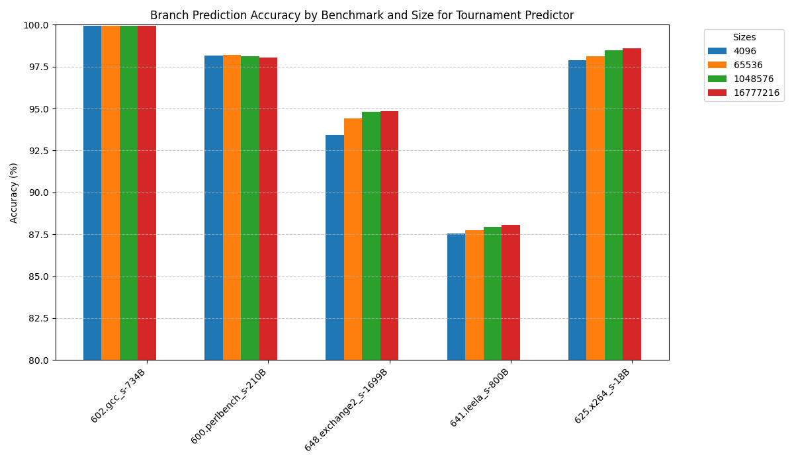
  ### [Q17 (Optional). Once adjusted to be a fair-size comparison, does the tournament predictor succeed in its goal of compared to global $2^n$ or local: Table 1: 256 entries, each entry $n$ bits, Table 2: $2^n$?](#q17-optional-once-adjusted-to-be-a-fair-size-comparison-does-the-tournament-predictor-succeed-in-its-goal-of-compared-to-global-2n-or-local-table-1-256-entries-each-entry-n-bits-table-2-2n-)
  - Based on the images below, the tournament predictor does succeed in its goal compared to global 2^n and local predictors. It consistently achieves high accuracy across different benchmarks and sizes, often matching or outperforming both global and local predictors. The tournament predictor effectively combines the strengths of global and local prediction strategies, maintaining high accuracy at smaller sizes like the local predictor while showing some improvement with larger sizes like the global predictor. This demonstrates its ability to adapt to various branch behaviors in different programs, providing a balanced and effective approach to branch prediction.

  
  
